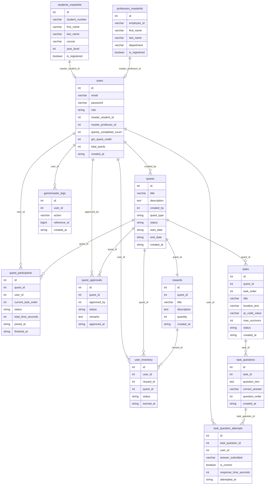
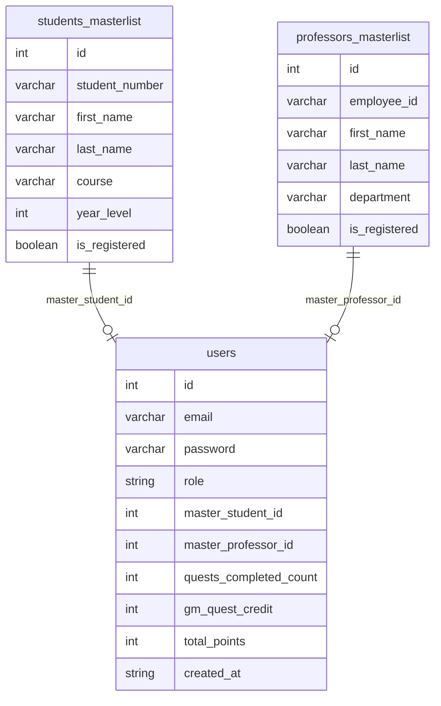
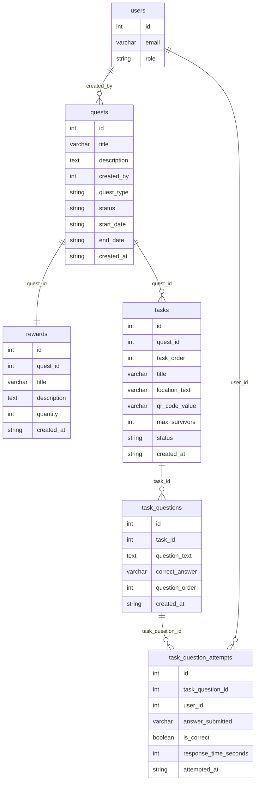
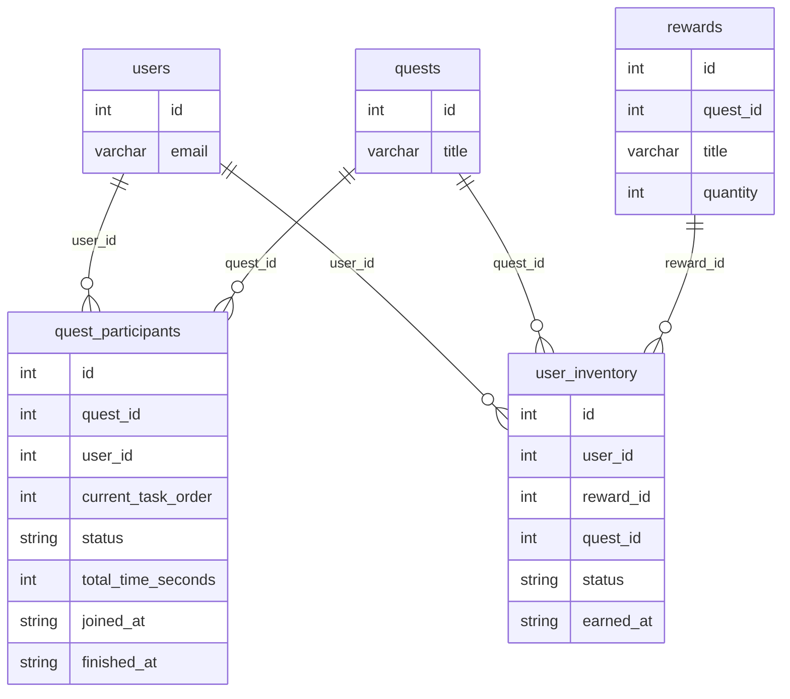
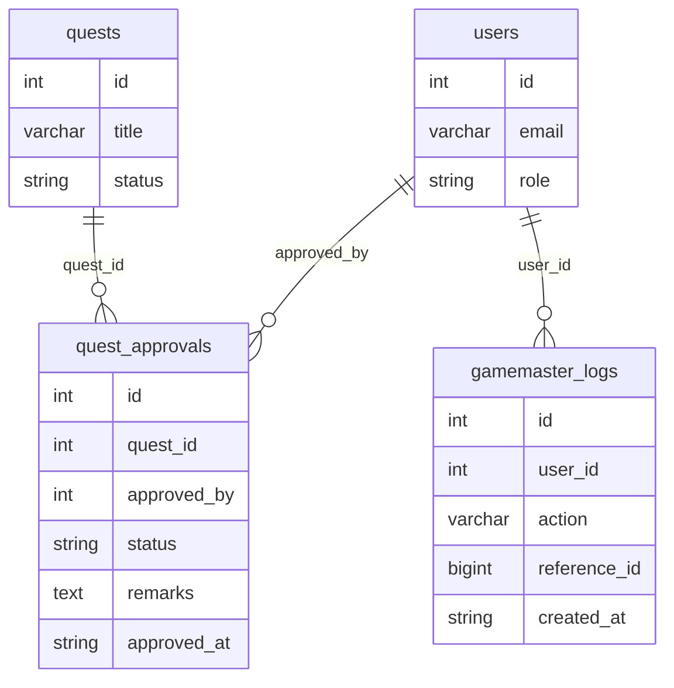

# CampusGo Database Diagram

Each section is a separate Mermaid ER diagram. Render in GitHub, GitLab, or VS Code (Mermaid support).

---

## 1. Overall

---

## 2. Users & identity

---

## 3. Quests & tasks

---

## 4. Participation & inventory

---

## 5. Governance

---

For field definitions and business context, see **CAPUSGO_DATABASE_SCHEMA.md**.
